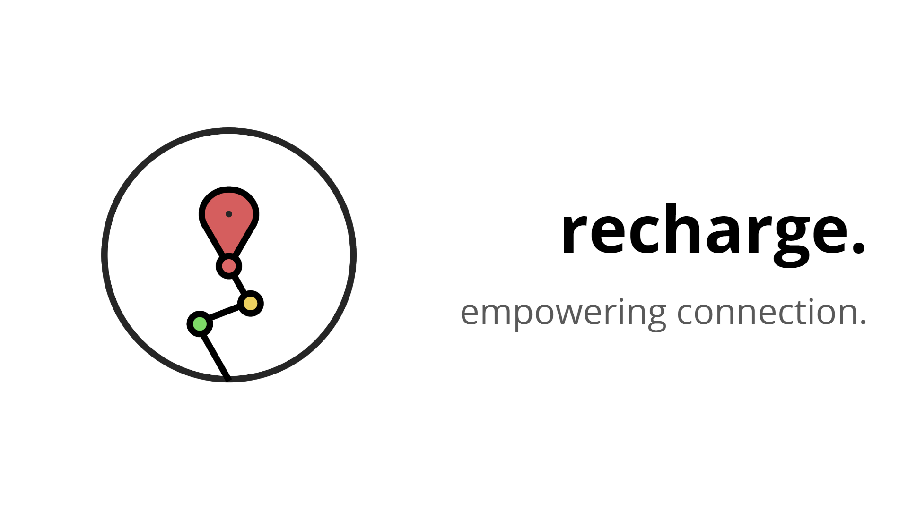

 

# Recharge

Have you ever been in desperate need of a charger, but felt too shy to ask anyone? Recharge is a mobile app that connects someone who needs a charger with someone nearby who is happy to lend one! Users are able to create their own accounts, customize their profiles, and discover others nearby who either need or have chargers. Our aim with this project is to promote social interaction amongst communities and encourage long-lasting friendships that stem from acts of generosity. Future implementations may include in-app messaging, notifications for low battery and charger requests, cloud synchronization with Firebase, and detailed routes between locations.
  

(Created at UBC’s Build Day, a 12-hour hackathon designed for beginners to experience the hacking scene and sponsored by Major League Hacking.)